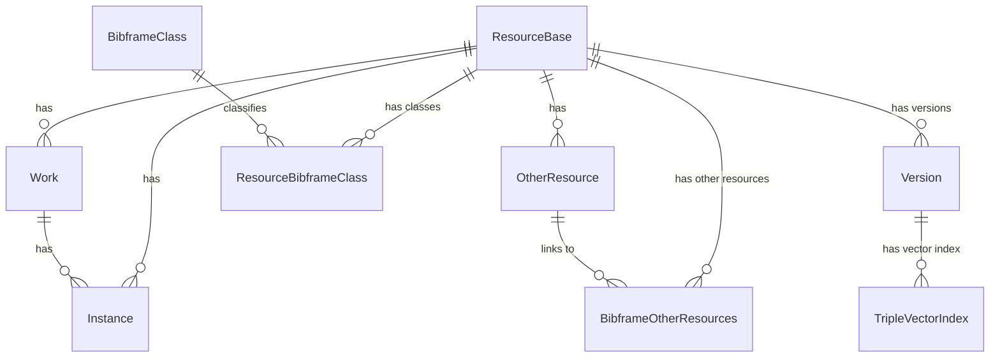

# Blue Core API

API for managing Blue Core resources and workflows using PostgresSQL and Airflow platforms.


## Project structure
```
bluecore_store_migrations/
|  |── env.py
|  |── versions/
|
src/bluecore_api/
│   │
│   ├── app/
│   │   ├── __init__.py
│   │   ├── main.py
│   │   ├── config.py
│   │   
│   │  
│   └── models.py
tests/
|
├── pyproject.yaml
└── README.md
```


## Installation

### Prerequisites
- [uv](https://github.com/astral-sh/uv)
- [Docker](https://www.docker.com/)
 
### Installation instructions
1.  Run `uv pip install -r requirements.txt`, and follow the instructions that appear.
2.  Run `docker-compose pull` to pull down all images.

## Running the application
To start all of the supporting services (PostgresSQL, etc.):
`docker-compose up -d`

The Postgres Docker database with the [PGVector](https://github.com/pgvector/pgvector) 
extension will be available on port 5432. When the database is first brought up, 
the `create-db.sql` script is run that creates a `bluecore` database with a 
`bluecore_admin` user. After the database is run, run `uv run alembic upgrade head`
to create the latest database tables and indicies for the database.


**In development**: To start the FastAPI rest server in dev mode and run the application at [http://localhost:3000](http://localhost:3000):
`uv run fastapi dev src/bluecore/app/main.py --port 3000`

This is in development mode and code changes will immediately be loaded without having to restart the server.

## Database Management
The [SQLAlchemy](https://www.sqlalchemy.org/) Object Relational Mapper (ORM) is used to create
the Bluecore database models. 



### Database Migrations with Alembic
The [Alembic](https://alembic.sqlalchemy.org/en/latest/) database migration package is used
to manage database changes with the Bluecore Data models.

To create a new migration, ensure that the Postgres database is available and then run:
- `uv run alembic revision --autogenerate -m "{short message describin change}`

A new migration script will be created in the `bluecore_store_migration` directory. Be sure
to add the new script to the repository with `git`.

#### Applying Migrations
To apply all of the migrations, run the following command:
- `uv run alembic upgrade head`

## Developers

### Linter for Python 
Bluecore API uses [ruff](https://docs.astral.sh/ruff/)
- `uv run ruff check`

To auto-fix errors in both (where possible):
- `uv run ruff check --fix`

### Unit, feature, and integration tests
Unit and Feature Tests are written with pytest.

To run all of the tests:
- `uv run pytest`

To drop into the Python debugger when a test fails add the following parameters to above command:
- `uv run pytest -s --pdb` 


